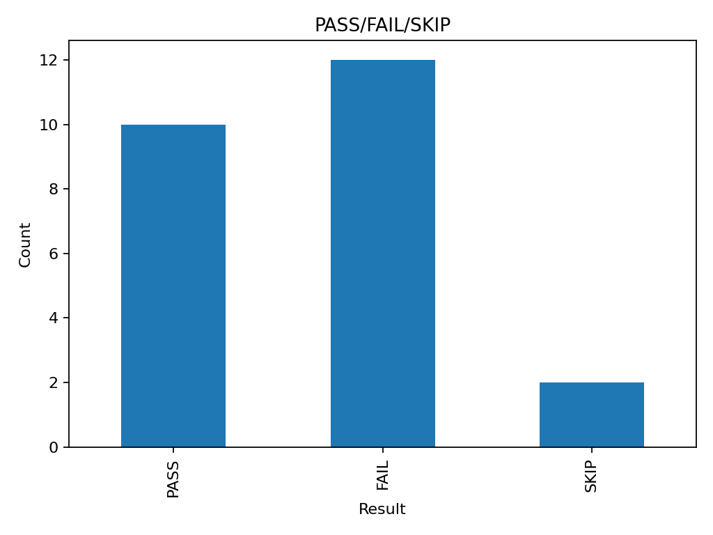

# T1000 Comparative Report v1

## Summary
Baseline: T1000-STABLE  
Total cases: 12  
Baseline pass_rate: 0.4167  
Threshold guard: 0.70 (temporarily lifted for baseline)  

## Models Compared
| Model | pass_rate | delta_pp |
|--------|------------|-----------|
| llama3.1:8b-local | 0.4167 | -23.33 |
| mistral-nemo-local | 0.4167 | -23.33 |
| q4o-mini-cloud | 0.4167 | -23.33 |

## Visuals

## Notes
- Все пайплайны прошли успешно (`ok=1`).
- Система стабильна, baseline зафиксирован.
- Следующий шаг — расширение корпуса (20→50→100 кейсов) и калибровка порога guard.
